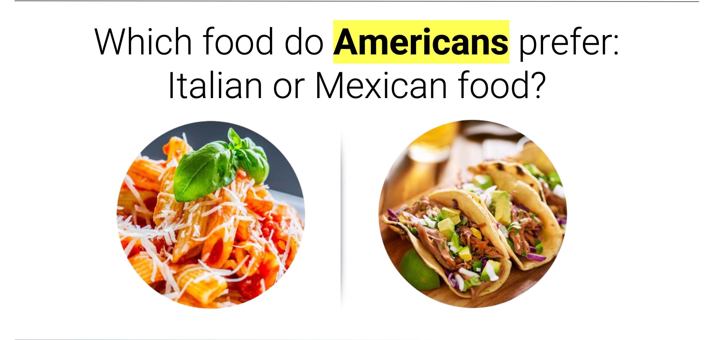

# Yelp Data Deeplearning Modeling

Contributors: 

* Caleigh Teahan : 
* Joe Demler : 
* JongWook Choe : 
* Nilusha D.G. : 
* Vidhya Lakshmi : 

## Introduction:

In this project, we analyzed restaurant data from across the United States to try and draw conclusions on consumer trends, specifically their preference in cuisines. We later took this data and created machine learning models to attempt to predict consumer restaurant ratings. Bringing back the old question of, which do Americans perfer Italian or Mexican food?

## Methods We Used: 

* Data Preparation: We extracted data from the Yelp API under specified location parameters. Then, we converted, cleaned and dropped unnecessary columns to create a usable Pandas dataframe.
* Data Visualization: Using Tableau and Mathplotlib, we created visualization to explain our data and to show
* Machine learning Modeling: Using both supervised and neural network models to train our data to predict a restaurant's rating based on the parameters of price, location, cuisine and customer reviews.

## Extracting the Data:

* Objective: To collect restaurant data from Yelp’s API, perform analysis and create a model to predict restaurant rating.
* Filters added to request: 
* Location- Top 40 cities based on population
* Cuisines- Mexican, Italian
* Offset - To avoid duplicates while getting a large set of data
* Total = 19145 restaurants 
* Columns = id, alias, name, image_url, is_closed, url, review_count, categories, rating, coordinates, transactions, price,location, phone, display_phone, distance, group_city

## Data Cleaning:

* Dropped columns('alias,' 'phone,' 'display_phone,' and 'distance') irrelevant to analysis
* Creating a new column for cuisines, converting categories column from string to list of dictionaries and applying lambda function to extract cuisine titles. 
* Extracting latitude and longitude from coordinates column
* Converted the 'price' column from symbols ('$' to '$$$$') to integers (1 to 4) for price related analysis
* columns= id, name, image_url, is_closed, url, review_count, rating, transactions, price, group_city, cuisines, latitude, longitude, state

## Data Exploration:

* Using box plots to show the spread of our data based on rating, review count and price. Some outliers can be explained by the large number of chain restuarants.
* Bar graphs we used to show the comparison between west and east coast preferences.

Tableau Dashboard link:  [Link](https://public.tableau.com/app/profile/nilusha.dg/viz/Project4_16955975765120/DashboardP4?publish=yes)

## Supervised Learning Models:

We used two different types of supervised learning models to predict a restaurant’s rating  based off our data
* Random Forest Regressor and Classifier: 63% accuracy and a root mean square of 0.48
* Nearest Neighbor Regressor and Classifier: 61% accuracy and a root mean square of 0.61

Our project dived into the extensive analysis of restaurant data across the United States, focusing on consumer preference for Italian and Mexican cuisine. Through data preparations and visualizations we gained valuable insights.

Collecting data more with a greater data context (restaurant attributes, etc.) to improve our machine learning model accuracy would have been a nice improvement.

## Neural Network Models:

Data Preprocessing:
* We began by examining the correlation between variables to identify any misleading or irrelevant columns.
* We retained only the columns that were highly correlated with our target variable.
* We checked for data skewness and observed that there were 12,079 "True" instances and 11,294 "False" instances, indicating a relatively balanced dataset.
      
Oversampling with SMOTE:
* To address the class imbalance, we employed the Synthetic Minority Over-sampling Technique (SMOTE) algorithm.
* SMOTE generated synthetic samples for the minority class, helping balance the dataset.
      
Model Architecture:
* We designed a neural network with three hidden layers:
* The first hidden layer had 400 nodes.
* The second hidden layer had 150 nodes.
* The third hidden layer had 5 nodes.
        
We used the hyperbolic tangent (tanh) function as the activation function for the hidden layers and the sigmoid function for the output layer.
      
Model Training:
* We trained the neural network on the preprocessed and oversampled data.
* The model achieved an accuracy of 68% on the test data, indicating its performance on unseen data.

## Copyright

Data for this dataset was generated by edX Boot Camps LLC, and is intended for educational purposes only.

